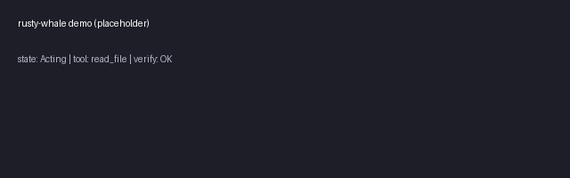

# rusty-whale



> Open-source, community-driven agent harness — bring your own model.
> Inspired by [CodeWhale](https://github.com/Hmbown/CodeWhale) (40k+ stars), rewritten from scratch in Rust with a lighter core and stronger verify loop.

## Why

CodeWhale is a 40k-star Rust agent harness, but:
- 30+ provider implementations add bloat — most users only need top 5
- Verify loop is cargo-only — multi-language projects (Python/JS/Go) get no auto-verify

**rusty-whale** ships a lighter provider layer (top 5: OpenAI/Anthropic/Gemini/Ollama/vLLM) + a pluggable verify system (cargo/npm/pip/go test).

## Architecture

```
rusty-whale/
  crates/
    rusty-whale-core/      # Agent loop, state machine, tool dispatch
    rusty-whale-provider/  # LlmProvider trait + 5 implementations
    rusty-whale-verify/    # Pluggable verify (cargo/npm/pip/go)
    rusty-whale-tui/       # Terminal UI (ratatui differential rendering)
  examples/
    basic-agent.rs
    custom-verify.rs
```

### Core trait

```rust
pub trait LlmProvider: Send + Sync {
    async fn complete(&self, req: &CompletionRequest) -> Result<CompletionResponse>;
    fn name(&self) -> &str;
    fn supports_tools(&self) -> bool;
    fn supports_streaming(&self) -> bool;
}
```

### Agent loop (state machine)

```
Idle → Thinking (LLM call) → Acting (tool dispatch) → Verifying (auto-cargo/npm) → Done|Waiting
```

## Install

```bash
cargo install rusty-whale
```

## Quick start

```bash
# Set provider keys
export OPENAI_API_KEY=sk-...
export ANTHROPIC_API_KEY=sk-ant-...

# Run interactive TUI
rusty-whale

# Run non-interactive exec mode
rusty-whale exec "refactor the auth module to use async"
```

## Provider configuration

```toml
# ~/.rusty-whale/config.toml
[roles.default]
provider = "anthropic"
model = "claude-sonnet-4-5"
reasoning_tier = "standard"

[roles.codegen]
provider = "openai"
model = "gpt-5-coder"
reasoning_tier = "high"
```

Each role explicitly records `provider`, `model`, and `reasoning_tier` — so a fleet can span vendors and a role's route never depends on whichever provider happens to be active.

## Verify system

Auto-verify after tool execution. Pluggable:

```toml
[verify]
command = "cargo build --release"   # or "npm test" / "pytest" / "go test ./..."
fail_action = "retry"               # retry | abort | ask
max_retries = 3
```

## Roadmap

- [x] Core agent loop + state machine
- [x] 5 provider implementations
- [x] Pluggable verify
- [x] TUI (ratatui)
- [ ] exec mode (non-interactive script mode)
- [ ] i18n (多语言 TUI)
- [ ] MCP client support

## License

MIT — see [LICENSE](LICENSE).

## Acknowledgments

- [CodeWhale](https://github.com/Hmbown/CodeWhale) — original 40k-star Rust agent harness that inspired this rewrite
- [ratatui](https://github.com/ratatui/ratatui) — Terminal UI framework
